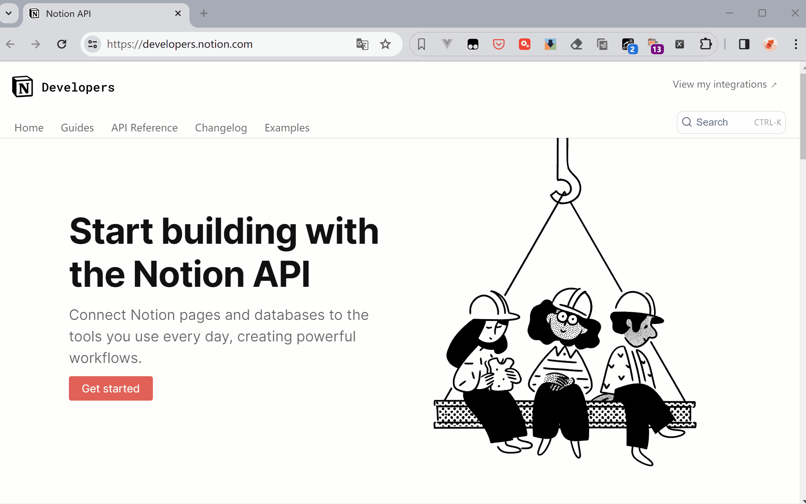
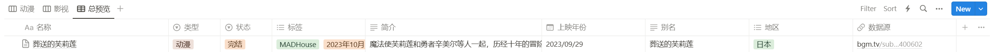
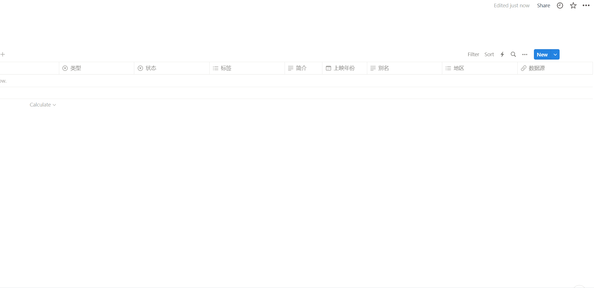
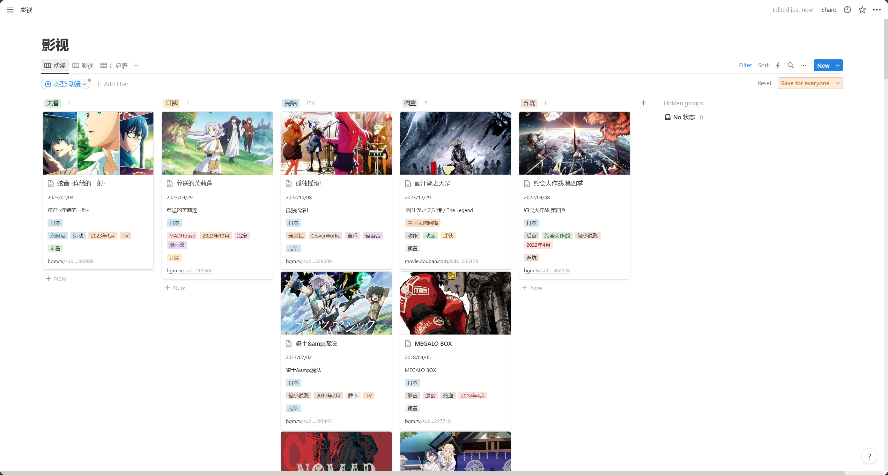
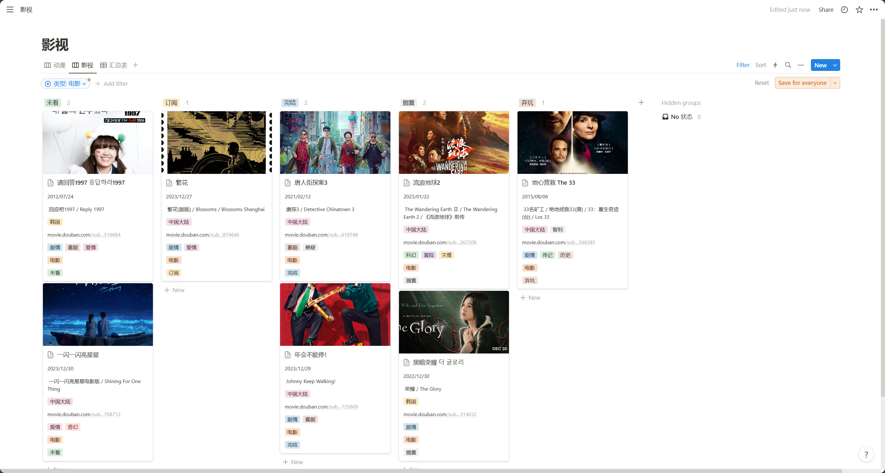

### 介绍

项目介绍:

- 本项目通过notion开放的api接口构建影视墙
- 数据来源为[bangumi](https://bangumi.tv/)与[豆瓣电影](https://movie.douban.com/)


- [notion页面的效果预览](https://pie-saturday-9af.notion.site/2327d87974bd4b85aac383797a5c7797?v=b01a6aac9ea94ce4b3ba065b3f8d4dae)


文件结构:

```c
.
|-- batch
|   |-- bangumi
|   |   |-- data.json  # https://raw.githubusercontent.com/bangumi-data/bangumi-data/master/dist/data.json
|   |   `-- data_parse.py # 分析json文件中的bangumi,找到输入内容对应的id
|   `-- douban_top_250
|       `-- top250.py # 爬取豆瓣top250的id
    
|-- crawler
|   |-- bangumi.py # 爬取bangumi的信息
|   |-- bangumi_api.py # 通过api接口访问信息抓取bangumi信息
|   `-- douban.py # 爬取豆瓣信息
    
|-- log
|   `-- logger.py # 日志记录脚本
|   `-- logging.log # 执行过程的日志信息,运行后生成
    
|-- notion  # 构建提交到notion中的json信息
|   |-- build_notion_children.py #页面"内容"
|   |-- build_notion_page.py  #页面属性 + 内容
|   `-- notion_token.py # notion机器人的秘钥与数据库的id
    
|-- subject # 当使用文件的批量更新时,会读取该文件中的每一项进行插入
|   |-- bangumi_subject.py  # bangumi
|   `-- douban_movie_subject.py # 豆瓣
    
`-- util
|   |-- client.py # 发起请求
|   |-- header.py # user-agent模拟
|   `-- utils.py # 工具
    
|-- main.py # 程序入口

```


### 教程

#### 环境准备

- 使用python语言编写,所以需要安装[python环境](https://www.python.org/) 安装向导中，请确保勾选 "Add Python x.x to PATH" 选项

- 安装项目所需的模块

  >pip install requests
  >
  >pip3 install lxml 
  >
  >pip install html2text


#### 接口申请

- 打开[developers](https://developers.notion.com/)
- 登录后创建一个"integration",并复制`secret`




#### 创建数据库
- 可以直接从我的网页这里复制过去[notion页面](https://pie-saturday-9af.notion.site/2327d87974bd4b85aac383797a5c7797?v=b01a6aac9ea94ce4b3ba065b3f8d4dae)





对于状态,默认设置的是完结,你可以按照(未看,订阅,完结,搁置,弃坑)进行添加,也可以自行设置

表头的"动漫","影视" 可以按照分类进行筛选,添加两个视图(view)就好


#### 引入"integration"




#### 运行程序

- 确保打开的数据库的页面中,查看当前的链接

> https://www.notion.so/nanfeng-jinhe/30810c5635a74b6c91a3b4d92169ad64?v=696eb61264e146d7a88fedc487817713
>
> https://www.notion.so/nanfeng-jinhe/{api_database_id}?v=696eb61264e146d7a88fedc487817713
>
> 其中30810c5635a74b6c91a3b4d92169ad64是我们需要

- 打开项目的`notion/notion_token.py`,将最开始复制的秘钥与此处的数据库id粘贴进去

```
api_database_id = "30810c5635a74b6c91a3b4d92169ad64"
api_secret = "secret_2PvfMrreobypBqo4CgAfcuu7d0zmkuGVAb223J3RkI2"
```


在项目文件夹处右击"在终端中打开",输入`python main.py`,出现以下即为成功

```
======================更新模式======================
【1:批量插入:从文件中读取】
【2:输入插入:从控制台输入】
【0:退出】
```


- 如果想要批量添加,打开`notion/subject/`,将对应网站的id,填充进去,然后输入'1',从文件中读取,在输入网站对应的数字即可

同时从两个网站中获取资源输入'3'

```js
# bangumi网站
subject/bangumi_subject :
            example:https://bgm.tv/subject/{id}
                    https://bgm.tv/subject/400602
                    id:400602

# 豆瓣网站
subject/douban_movie_subject :
            example:https://movie.douban.com/subject/{id}
                    https://movie.douban.com/subject/35768712
                    id:35768712
```

> 打开你需要爬取的网站(注:豆瓣只能爬取豆瓣电影!!),找到你要爬取的页面的`id`


- 如果只想要单个获取,输入2,从控制台获取,同理先输入网站对应的数字,在输入id


#### 运行示例

```bash
======================更新模式======================
【1:批量插入:从文件中读取】
【2:输入插入:从控制台输入】
【0:退出】
1
数据源:
【1:豆瓣】
【2:bangumi】
【3:豆瓣 + bangumi】
1
=====>插入成功: 一闪一闪亮星星
=====>插入成功: 画江湖之天罡
=====>插入成功: 年会不能停！
=====>插入成功: 唐人街探案3
第二次重试开始!!
最终失败列表:
======================更新模式======================
【1:批量插入:从文件中读取】
【2:输入插入:从控制台输入】
【0:退出】
2
数据源:
【1:豆瓣】
【2:bangumi】
2
请输入1个bangumi subject_id:395378
=====>插入成功: 迷宫饭
```


> 数据库的一些细节性的设置,可以按照自己喜欢的来,此处不再赘述


#### 问题

403: 在爬取豆瓣的时候出现403,说明豆瓣可能将你的ip加入黑名单了,最简单的解决就是使用手机开热点 (ͼ̤͂ ͜ ͽ̤͂)✧

409: 如果比较多的话,可能是抓取速度过快,notion那边接收有问题,把`main.py`出现这个函数的位置的最后一个数字改小点,抓取速度就会变慢,例如:

```
thread_func(bangumi_parse, bangumi_subject.a_list, 10)
```


[notion api 状态码](https://developers.notion.com/reference/status-codes)


### 效果





